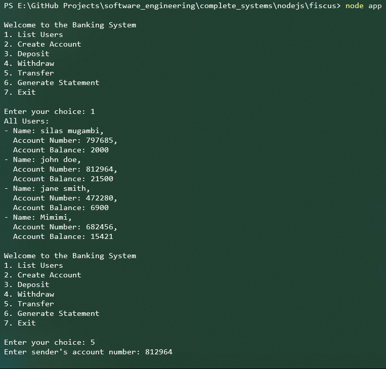

# Fiscus: Simple Banking System with Transaction History




Fiscus is a simple banking system implemented in JavaScript with Node.js. It provides users with the ability to create accounts, deposit funds, withdraw funds, transfer funds between accounts, list all users, and generate account statements with transaction history using terminal.

## Features

- **Account Creation**: Users can create a new account with a unique 6-digit account number and an initial balance.
- **Deposit**: Users can deposit funds into their accounts, and the transaction history is recorded.
- **Withdrawal**: Users can withdraw funds from their accounts, and the transaction history is recorded.
- **Transfer**: Users can transfer funds between their accounts or to other users' accounts, and the transaction history is recorded for both sender and receiver accounts.
- **Transaction History**: Users can generate an account statement with a transaction history showing all deposits, withdrawals, and transfers.
- **List Users**: Users can view a list of all users along with their account details.

## Tech Stack

- **Language**: JavaScript
- **Framework**: Node.js
- **Database**: JSON (stored locally)
- **Dependencies**: `readline-sync` for user input handling

## Installation

1. Clone the repository:

   ```bash
   git clone https://github.com/mugambi12/fiscus.git
   ```

2. Navigate to the project directory:

   ```bash
   cd fiscus
   ```

3. Install dependencies:

   ```bash
   npm install
   ```

## Usage

Run the application:

```bash
node app
```

Follow the on-screen instructions to perform various banking operations:

- Create Account
- Deposit
- Withdraw
- Transfer
- List Users
- Generate Statement
- Exit

## Contributing

Contributions are welcome! If you have suggestions for improvements, please open an issue or submit a pull request.

## License

This project is licensed under the MIT License - see the [LICENSE](LICENSE) file for details.

---
